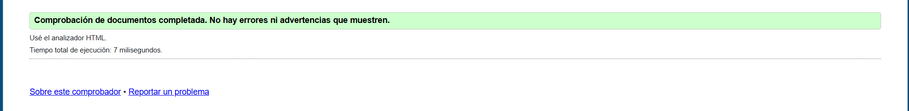

# Proyecto Fundamentos Web - Taller 3 (Grupo 4303)

En esta entrega trabajé en la maquetación CSS del sitio, ajustando los estilos de las tres páginas (Ciberseguridad, Nube y Realidad Virtual/Aumentada) y corrigiendo los errores que salieron al validar el HTML.

## 1. Cambios y correcciones en HTML

Pasé el código por el validador del W3C y arreglé los siguientes detalles de estructura:

* **Página 1 (index.html):** Quité un `<title>` que estaba repetido dentro de un `<figure>`. También acomodé el `<header>`, `<nav>`, `<main>` y `<figure>` para que quedaran bien metidos dentro del `<body>`.
* **Página 2 (nube.html):** Había un `<h2>` que quedó por fuera del `<body>` y lo moví a su sitio. Además le puse el `<figcaption>` a la imagen que no lo tenía.
* **Página 3 (realidad.html):** Mismo problema con un `<h2>` fuera de lugar; lo metí al `<body>` y le agregué su `<figcaption>`.

### Capturas del validador HTML

## 2. Hoja de estilos CSS (`css/styles.css`)

El diseño se maneja desde un solo archivo CSS compartido para que las tres páginas tengan exactamente la misma apariencia.

### Nomenclatura y organización

* Todo en el CSS (variables y comentarios) 
* Las variables usan el formato **`kebab-case`** (por ejemplo: `--bg-card`, `--color-accent`).
* Usé selectores directos a las etiquetas semánticas (`header`, `main`, `nav`, `section`, `table`) para no llenar el HTML de clases innecesarias.

### Paleta de colores

Elegí un tema oscuro con acentos en azul claro/cian para que se viera moderno y acorde a temas de tecnología, además de asegurar buen contraste con el texto:

| Variable | Código Hex | Para qué se usa |
| --- | --- | --- |
| `--bg-card` | `#25384a` | Fondo de las tarjetas de contenido |
| `--text-primary` | `#F8FAFC` | Texto principal (blanco para que se lea fácil) |
| `--text-secondary` | `#94A3B8` | Subtítulos, ítems y pie de página |
| `--color-accent` | `#38BDF8` | Títulos (`h1`, `h2`, `h3`) y enlaces |
| `--color-hover` | `#0EA5E9` | Color al pasar el cursor sobre los links |
| `--color-border` | `#334155` | Bordes de las tarjetas y tablas |

> **Nota de diseño:** Dejé una imagen de fondo fija (`background-attachment: fixed`) y tarjetas oscuras encima. Esto ayuda a que el texto resalte sin cansar la vista.

### Pruebas de Cascada y Especificidad

* **Reset inicial:** Usé `*` para quitar los márgenes y rellenos por defecto del navegador y poner el `box-sizing: border-box`.
* **Especificidad:** Definí reglas como `nav a:hover` para cambiar el color base de los enlaces únicamente dentro del menú.
* **Ancho fijo:** Dejé las secciones con un `max-width: 900px` y `margin: 0 auto` para mantener todo centrado y ordenado.

---

## 3. Validación CSS

Validé el archivo `css/styles.css` en la herramienta oficial de la W3C y quedó limpio sin errores ni advertencias.