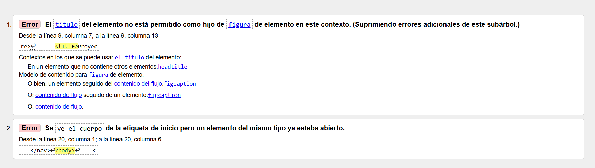
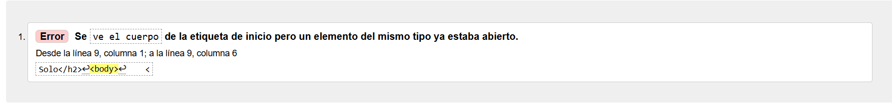
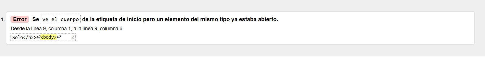

## Validación HTML

### Página 1

**Errores encontrados:**

* Había una etiqueta `<title>` dentro de `<figure>`, lo cual no corresponde.
* Algunos elementos estaban fuera de la etiqueta `<body>`.

**Correcciones realizadas:**

* Se eliminó la etiqueta `<title>` que estaba repetida dentro de `<figure>`.
* Se dejó una sola etiqueta `<title>` dentro de `<head>`.
* Se organizaron las etiquetas `<header>`, `<nav>`, `<main>` y `<figure>` dentro de `<body>`.

### Página 2

**Errores encontrados:**

* Había una etiqueta `<h2>` ubicada fuera de `<body>`.
* Faltaba la etiqueta `<figcaption>` en la imagen.

**Correcciones realizadas:**

* Se movió la etiqueta `<h2>` al lugar correspondiente dentro de `<body>`.
* Se agregó `<figcaption>` para describir la imagen.

### Página 3

**Errores encontrados:**

* Había una etiqueta `<h2>` fuera de `<body>`.
* Faltaba la etiqueta `<figcaption>` en la imagen.

**Correcciones realizadas:**

* Se movió el `<h2>` dentro de `<body>`.
* Se agregó `<figcaption>` debajo de la imagen.

